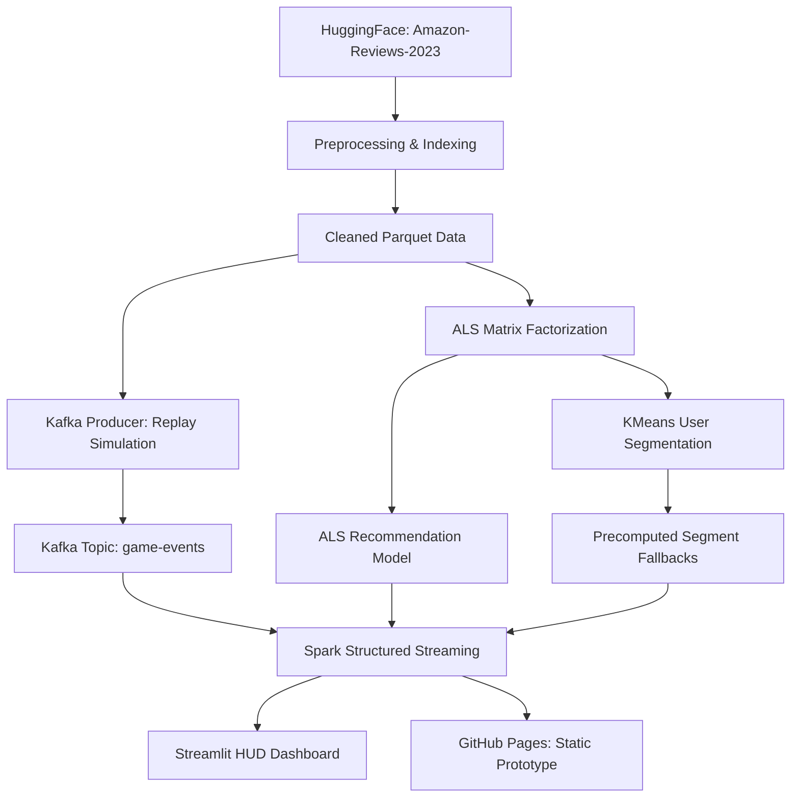

# 🎮 Project Nexus — Real-Time Game Recommendation System

An end-to-end Big Data pipeline for personalized video game recommendations. This system leverages **Apache Spark** for batch training and structured streaming, **Kafka** for event-driven data ingestion, and **Streamlit** for a real-time HUD dashboard.

## 🏗️ System Architecture

The project is designed as a modular pipeline where batch-trained ML models are integrated into a low-latency streaming environment:



### Core Architecture Components

- **Data Ingestion & Preprocessing**: Loads the `raw_review_Video_Games` subset from HuggingFace. Performs deduplication, cleaning, and string indexing to map user/item IDs to integer indices required by ALS.
- **Collaborative Filtering (ALS)**: Trains an Alternating Least Squares model. Includes hyperparameter tuning via grid search to minimize RMSE.
- **Personalized Segmentation (KMeans)**: Extracts user latent factors from the ALS model and clusters users into five distinct behavioral segments (e.g., Enthusiast, Critic, Hardcore).
- **Event Streaming (Kafka)**: A producer simulates a real-time event stream by replaying cleaned dataset records. It features user-based partitioning (`user_idx % 2`) to ensure ordering and user-locality.
- **Structured Streaming Pipeline**: Processes the Kafka stream with a 30s sliding window and 15s watermark. Handles JSON parsing, dead-letter routing for malformed data, and real-time engagement scoring.
- **Recommendation Engine**: Integrates models into the stream. It provides ALS predictions for known users and falls back to segment-based "Top-5" items for cold-start users.
- **HUD Dashboards**: 
    - **Live Dashboard**: A Streamlit app with a "Gaming HUD" aesthetic, featuring glassmorphism, neon accents, and real-time Plotly charts.
    - **Static Prototype**: A GitHub Pages-hosted HUD (`dashboard/index.html`) using Chart.js to visualize the design system.

## 📊 Dataset Specifications

The system utilizes the **McAuley-Lab/Amazon-Reviews-2023** dataset:
- **Source**: HuggingFace (`raw_review_Video_Games`)
- **Focus**: 5-core reviews (high density)
- **Features**: `user_id`, `parent_asin` (item_id), `rating`, and `timestamp`.

## 📁 Project Structure

```
project-nexus/
├── code/
│   ├── preprocessing.py         # Data cleaning & StringIndexing
│   ├── train_als.py             # ALS model training & tuning
│   ├── train_kmeans.py          # User segmentation & fallback precomputation
│   ├── kafka_producer.py        # Replay-based simulator with fault injection
│   ├── streaming_pipeline.py    # Structured Streaming & windowed analytics
│   ├── recommendation_engine.py # ML + Streaming integration logic
│   └── dashboard.py             # Streamlit HUD Dashboard
├── models/                      # Saved ML artifacts & indexers
├── data/                        # Cleaned data & segment metadata
├── dashboard/                   # Static HUD prototype (GitHub Pages)
└── requirements.txt             # Project dependencies
```

## 📐 Data Handling Policies

### Late Data & Watermarking
| Parameter | Value | Rationale |
|-----------|-------|-----------|
| Watermark | 15 seconds | Late data (>15s) is dropped to prevent skewed window aggregates. |
| Window Size | 30 seconds | Captures meaningful activity bursts for trending detection. |
| Slide Interval| 10 seconds | Ensures the dashboard reflects fresh data every 10 seconds. |

### Cold-Start Policy
- **Primary**: ALS collaborative filtering for known users.
- **Fallback**: Segment-based majority vote based on user interaction history.
- **New Users**: Global trending items based on the current 30s streaming window.

## ⚙️ Environment & Setup

- **Python**: 3.10+
- **Frameworks**: PySpark 3.5, Kafka-python-ng, Streamlit 1.35
- **Infrastructure**: Kafka broker at `localhost:9092`, Spark master at `local[*]`
- **SLA**: Target recommendation latency < 5.0 seconds.

### Quick Start Guide

Follow these steps to run the complete end-to-end pipeline in your local environment.

#### 1. Setup & Start Kafka (Native Windows)
To bypass the notorious Windows path-length limit, Kafka must be extracted to a short directory name (e.g. `k/`).
1. Download Apache Kafka (e.g., `kafka_2.13-3.x.x.tgz`) from the [official downloads page](https://kafka.apache.org/downloads).
2. Extract the archive using a tool like 7-Zip or WinRAR.
3. Rename the extracted folder (which contains subfolders like `bin`, `config`, etc.) simply to `k`.
4. Place the `k` folder directly in the root of this project.

Open two separate PowerShell terminal windows to start Zookeeper and Kafka:

**Terminal 1:**
```powershell
.\k\bin\windows\zookeeper-server-start.bat .\k\config\zookeeper.properties
```

**Terminal 2:**
```powershell
.\k\bin\windows\kafka-server-start.bat .\k\config\server.properties
```

#### 2. Data Preparation & Model Training
Open a new terminal (Terminal 3). First, ensure your dependencies from `requirements.txt` are installed. Then, run the batch processing and ML scripts to prepare the needed artifacts:

```powershell
# 1. Download and preprocess data (saves to data/live_events.csv, etc.)
python code/preprocessing.py

# 2. Train the ALS recommendation model
python code/train_als.py

# 3. Compute user K-Means segments for cold-start fallbacks
python code/train_kmeans.py
```

#### 3. Run the Streaming Pipeline
In Terminal 3 (or a new terminal), start the Native Python Stream Processor. It listens to Kafka, calculates analytics, and produces metrics:

```powershell
python code/streaming_pipeline.py
```

#### 4. Start the Kafka Producer
Open Terminal 4. Start the Kafka producer to simulate a live stream of gaming events from our cleaned dataset.

```powershell
python code/kafka_producer.py
```

#### 5. Launch the Live HUD Dashboard
Open Terminal 5. Run the Streamlit application to visualize the live streaming metrics and real-time recommendations.

```powershell
streamlit run code/dashboard.py
```
After running this command, your browser should automatically open at `http://localhost:8501`.
