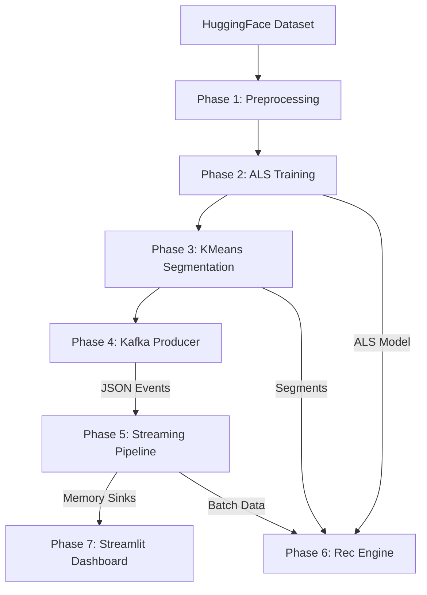

# 🎮 Project Nexus — Real-Time Game Recommender

An end-to-end Big Data pipeline for a video game recommendation system. Features real-time event streaming via Kafka, Spark Structured Streaming for windowed analytics, and a hybrid recommendation engine combining ALS collaborative filtering with KMeans user segmentation.

## 📋 Table of Contents
- [Architecture](#architecture)
- [Dataset](#dataset)
- [Project Structure](#project-structure)
- [Setup & Installation](#setup--installation)
- [Running the Pipeline](#running-the-pipeline)
- [Phase Details](#phase-details)
- [Design Policies](#design-policies)
- [Live Dashboard](#live-dashboard)

---

## 🏗️ Architecture



---

## 📊 Dataset

**McAuley-Lab/Amazon-Reviews-2023**
- **Source**: HuggingFace (`raw_review_Video_Games`)
- **Scale**: ~5M+ records (filtered during preprocessing)
- **Schema**: `user_id`, `parent_asin` (item_id), `rating` (1-5), `timestamp` (Unix ms)

---

## 📁 Project Structure

```
project-nexus/
├── data/
│   ├── games_cleaned.parquet   ← output of Phase 1
│   ├── user_segments.parquet   ← output of Phase 3
│   └── segment_top5.parquet    ← output of Phase 3
├── models/
│   ├── user_indexer/           ← fitted StringIndexer (Phase 1)
│   ├── item_indexer/           ← fitted StringIndexer (Phase 1)
│   ├── als_model/              ← trained ALS (Phase 2)
│   └── kmeans_model/           ← trained KMeans (Phase 3)
├── code/
│   ├── preprocessing.py        ← Phase 1
│   ├── train_als.py            ← Phase 2
│   ├── train_kmeans.py         ← Phase 3
│   ├── kafka_producer.py       ← Phase 4
│   ├── streaming_pipeline.py   ← Phase 5
│   ├── recommendation_engine.py← Phase 6
│   └── dashboard.py            ← Phase 7 (Streamlit HUD)
├── dashboard/
│   └── index.html              ← Static HUD prototype (GitHub Pages)
├── requirements.txt
└── README.md
```

---

## ⚙️ Setup & Installation

### 1. Prerequisites
- Python 3.10+
- Java 8/11 (for Spark)
- Apache Kafka (running on `localhost:9092`)

### 2. Install Dependencies
```bash
pip install -r requirements.txt
```

### 3. Start Infrastructure (Kafka)
```bash
# Start Zookeeper
zookeeper-server-start.sh config/zookeeper.properties

# Start Kafka Broker
kafka-server-start.sh config/server.properties
```

---

## 🚀 Running the Pipeline

Execute phases in order across separate terminals:

```bash
# STEP 1: Build Models & Data
python code/preprocessing.py
python code/train_als.py
python code/train_kmeans.py

# STEP 2: Start Stream (Terminal 1)
python code/kafka_producer.py

# STEP 3: Start Pipeline (Terminal 2)
python code/streaming_pipeline.py

# STEP 4: Start Rec Engine (Terminal 3)
python code/recommendation_engine.py

# STEP 5: Start Dashboard (Terminal 4)
streamlit run code/dashboard.py
```

---

## 📝 Phase Details

### Phase 1 — Preprocessing
- Downloads directly from HuggingFace.
- Cleans data: drops nulls, filters ratings (1.0-5.0), deduplicates (keeps most recent).
- Fits `StringIndexer` models for both users and items to ensure consistent integer mapping across the pipeline.

### Phase 2 — ALS Training
- Trains Alternating Least Squares on `(user_idx, item_idx, rating)`.
- Implements hyperparameter grid search (Rank: 10-50, Reg: 0.01-0.5) if initial RMSE > 1.5.

### Phase 3 — KMeans Segmentation
- Extracts user latent factors from the ALS model.
- Clusters users into 5 segments (Enthusiast, Critic, Casual, Explorer, Hardcore).
- Precomputes segment-level Top-5 items for robust cold-start fallback.

### Phase 4 — Kafka Producer
- Replay-based simulator with 2 partitions (`user_idx % 2`).
- Fault injection: 15% cold-start users, 5% malformed records.

### Phase 5 — Streaming Pipeline
- Spark Structured Streaming with safe JSON parsing and dead-letter routing.
- Window analytics (30s window / 10s slide).
- 15s Watermark policy (Late data dropped to prevent window skew).

### Phase 6 — Recommendation Engine
- Hybrid Logic:
  1. **Known Users**: ALS predictions filtered by user segment.
  2. **Cold-Start (Known Segment)**: Segment-level Top-5 items.
  3. **Cold-Start (New User)**: Global trending items from the live stream.
- Latency Target: **< 5 seconds** per request.

### Phase 7 — Dashboard
- Real-time HUD (Heads-Up Display) built with Streamlit.
- Features: Throughput, Latency, Trending Leaderboard, Personalized Recommendations, and a Terminal Alert Feed.

---

## 📐 Design Policies

| Parameter | Value | Rationale |
|-----------|-------|-----------|
| Watermark | 15s | Half of slide (10s); late data cannot fill complete slides. |
| Partitioning | `user_idx % 2` | Ensures user-locality for stateful operations. |
| Cold-Start | Hybrid | Segment fallback for known archetypes; trending for absolute unknowns. |

---

## 🌐 Live Dashboard
A static prototype of the Gaming HUD is hosted on GitHub Pages:
[https://cludoy.github.io/Mini-project3/](https://cludoy.github.io/Mini-project3/)
